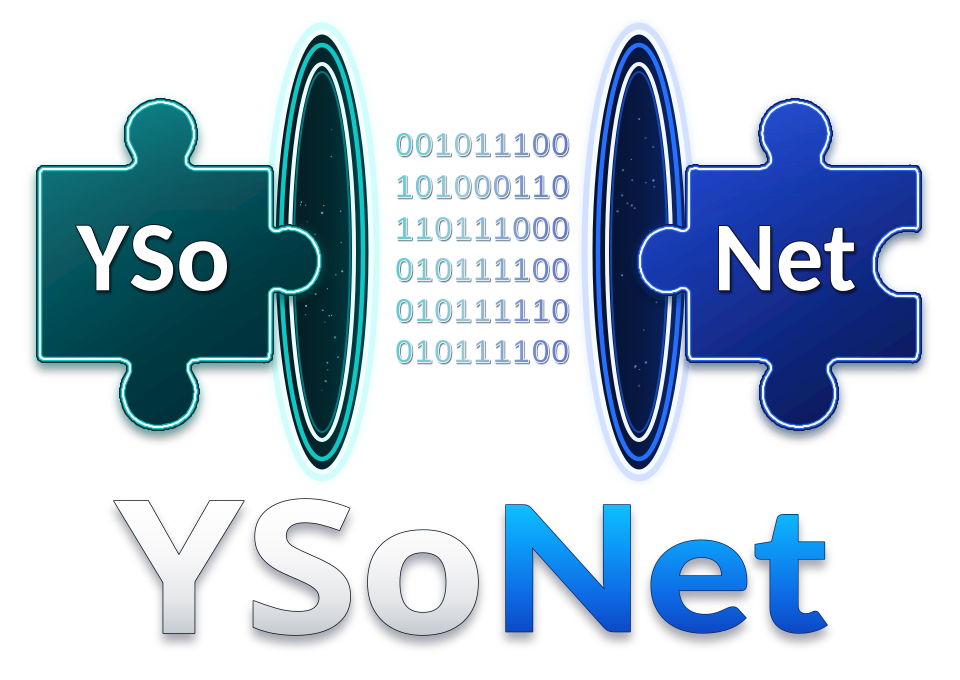

# About the logo

The YSoNet logo follows an object through serialization and deserialization:
into the first portal as an object, across as data, and out of the second as a
reconstructed object graph.

The different puzzle shapes highlight a possibility: reconstructed objects can
have state that ordinary application construction would never produce. Depending
on the serializer and types involved, deserialization may populate fields
directly, bypass constructors and their validation, resolve types from metadata,
or invoke callbacks and other code.

Gadget chains exploit existing code reachable through attacker-controlled types,
state, or object relationships, during deserialization or later use. The danger
lies in the behavior this enables, not simply in receiving a different object
instance. An attacker may craft the data without ever creating an original object.

**Reconstructing state can activate behavior.**

## Technical background

Microsoft documents [constructor bypass and state assumptions](https://learn.microsoft.com/en-us/dotnet/framework/wcf/feature-details/security-considerations-for-data#preventing-types-from-being-in-an-unintended-state),
[risks during callbacks and later use](https://learn.microsoft.com/en-us/dotnet/fundamentals/code-analysis/quality-rules/ca5362),
and [type-driven control flow in unsafe deserialization](https://learn.microsoft.com/en-us/dotnet/standard/serialization/binaryformatter-security-guide).
See also YSoNet's [security guidance](../SECURITY.md).
